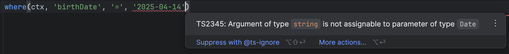

# Exercice 6

Être capable de sélectionner des lignes, c'est bien, mais pouvoir les filtrer ça serait canon, qu'en pensez-vous ?

C'est partit, implémentons une clause `where` ! L'objectif de cet exercice est d'à partir du typage actuel de le faire évoluer afin de pouvoir filtrer en fonction de critères définis.
Par exemple dans les tests, nous nous amuserons à filtrer sur la date de naissance ou encore le prénom des utilisateurs.



Rendez-vous dans le fichier `6-filtrer-des-lignes.ts` et `db.ts` pour l'implémentation.

À vous de jouer !

:::tip Ressources

- [Keyof & lookup](../typescript/keyof-lookup.md)
- [Types conditionnels](../typescript/conditional-types.md)

:::

## Indice 1

<details>
  <summary>Tout est là</summary>

La signature de `where` dépend du type du contexte (en l'occurrence de _sélection_ dans une _table_ d'une base de donnée arbitraire) ainsi que du nom et du type de champ (qu'on peut déduire de la _table_) sur lequel le filtre sera appliqué.

</details>

## Indice 2

<details>
  <summary>Faisons simple</summary>

Pour le moment, nous n'implémentons qu'une clause d'égalité, un type littéral devrait faire l'affaire pour l'argument `operator` !

</details>

## Indice 3

<details>
  <summary>Panachage</summary>

Au final, on va utiliser ici beaucoup de choses qu'on a déjà pu aborder : _lookup types_, mots-clé _keyof_ ou _extends_.

</details>

## Solution

<details>
  <summary>Avant de déplier pour afficher la solution, n'hésitez pas à nous solliciter ! </summary>

```ts
type FilterableContext<DB> = SelectableContext<DB> & {
  _fields: (keyof DB[keyof DB])[] | "ALL";
};

type AnyFilterableContext = FilterableContext<any>;

export const where = <
  Ctx extends FilterableContext,
  Field extends keyof Ctx["$db"][Ctx["_table"]]
>(
  ctx: Ctx,
  field: Field,
  operator: "=",
  value: Ctx["$db"][Ctx["_table"]][Field]
) => ({
  ...ctx,
  _where: {
    field,
    operator,
    value,
  },
});
```

</details>
