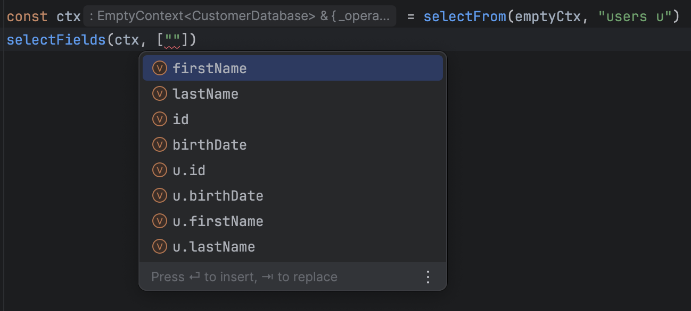

# Exercice 8

Wow ! On peut maintenant supprimer des enregistrements de notre base de données 🎉.

Même si nous pas encore d'implémentations pour les formules ou les jointures, il pourrait être chouette d'avoir la possibilité de créer des alias, non ?

Ne serait-ce que pour bien garder en tête qu'on est en train de manipuler des `codes_pays` quand bien même `c_iso_3166` signifie la même chose !



Rendez-vous dans le fichier `8-gestion-des-alias.ts` et `db.ts` pour l'implémentation.

À vous de jouer !

:::tip Ressources

- [Types génériques](../typescript/generic.md)
- [KeyOf & lookup](../typescript/keyof-lookup.md)
- [Hiérarchie des types](../typescript/type-hierarchy.md)
- [Types conditionnels](../typescript/conditional-types.md)

:::

## Indice 1

<details>
  <summary>Déclarer un alias sur une table</summary>
  
  Comment déclarer un alias (ou pas !) ? En effet, la subtilité ici est que dans la déclaration de sélection d'une table, on pourra avoir soit `le_nom_de_la_table` ou bien `le_nom_de_la_table son_alias`.

  Avant de savoir comment nous utiliserons cet alias ensuite, nous pouvons déjà tenter d'expliquer à TypeScript que les deux formes peuvent être employées.
  
</details>

## Indice 2

<details>
  <summary>Déclarer un alias sur champ</summary>
  
  C'est un peu le même cas que pour une table, il faut seulement prendre en compte la syntaxe ` as ` (qui sépare le nom du champ et son alias) en compte.
  
</details>

## Indice 3

<details>
  <summary>Utiliser ces alias</summary>
  
  Pour savoir si une syntaxe est acceptable, il va par exemple falloir déterminer si une table est aliasée ou non. Dans ce cas, on peut se demander si son invocation `extends` une structure du type `le_nom_de_la_table son_alias` ou non !   
</details>

## Solution

<details>
  <summary>Avant de déplier pour afficher la solution, n'hésitez pas à nous solliciter ! </summary>

Alias sur les tables :

```ts
type AliasedTabled<TB> = `${TB & string} ${string}`;
//                              ^? la table  ^? son alias
type TableOrAlias<TB> = TB | AliasedTabled<TB>;

type AnyTable<Ctx extends AnyEmptyContext> = TableOrAlias<keyof Ctx["$db"]>;

export const selectFrom = <
  Ctx extends AnyEmptyContext,
  TB extends AnyTable<Ctx>
>(
  ctx: Ctx,
  tableName: TB
) => ({
  ...ctx,
  _operation: "select" as const,
  _table: tableName,
});
```

Alias sur les champs

```ts
type AliasableField<T> = T | `${T & string} as ${string}`

type FieldOrExplicitField<Table, Field> = AliasableField<Field> | `${Table & string}.${AliasableField<Field> & string}`

type ExplicitableField<Ctx extends AnySelectableContext> = Ctx["_table"] extends `${infer Table} ${infer Alias}`
    ? FieldOrExplicitField<Alias, keyof Ctx['$db'][Table]>
    : FieldOrExplicitField<Ctx['_table'], keyof Ctx['$db'][Ctx['_table']]>

export const selectFields = <Ctx extends AnySelectableContext>(
  ctx: Ctx,
  fieldNames: ExplicitableField<Ctx>[]
) => ({
  ...ctx,
  _fields: fieldNames,
});
```

</details>
