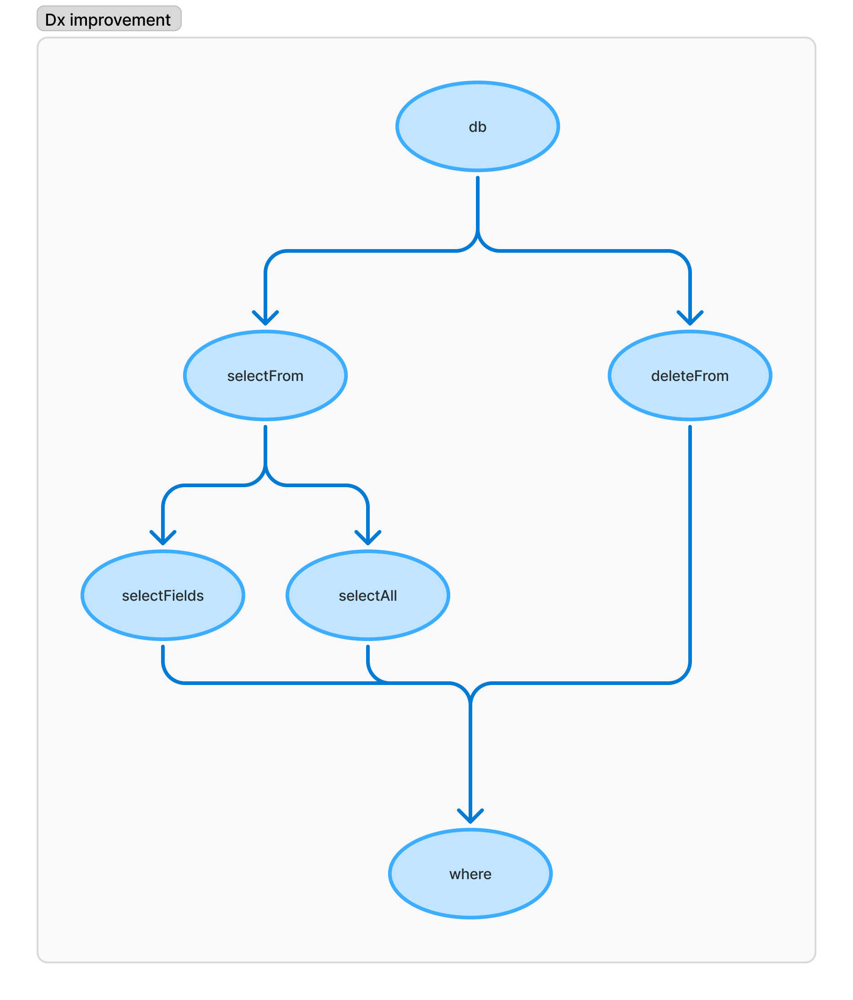

# Exercice 9

Prêt.e.s pour le dernier exercice ? C'est parti !

L'autocomplétion facilite grandement notre quotidien de développeur. C'est la raison pour laquelle nous vous proposons de refactorer le code que nous avons écrit dans le but d'améliorer notre développeur expérience.

Chaque amélioration compte. Vous pouvez refondre complétement le fichier `db.ts` ou wrapper les fonctions existantes. À vous de jouer !

:::tip Idées d'évolutions

- Se voir proposer `selectFields` après un `selectFrom`
- Ne pas pouvoir accéder au `selectFields` après un `selectAll`
- Ne pas pouvoir accéder au `selectFields` après un `deleteFrom`
- Pour le moment les exercices sont orientés programmation fonctionnelle mais vous pouvez changer de paradigme en utilisant des classes.

:::
