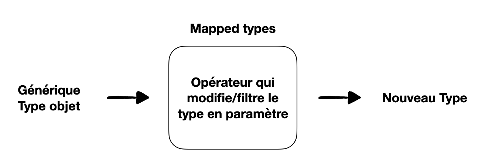

# Mapped Types ou Types mappés

### Comment cela fonctionne ?

Un mapped type est un Type qui prend en paramètre un type générique de type objet et qui va permettre de créer un nouveau type à partir ce dernier. Pour cela il va itérer sur les propriètés du type passé en paramètre et à l'aide d'un opérateur va modifier, filtrer les propriétés afin d'aboutir au nouveau type.

Bénéfices :

- Lisibilité du typage
- Outil pour créer/ modifier facilement des types
- Limite les redondances

Remarque : les mapped types sont d'aucune utilité sur les types primitifs puisqu'ils viennent manipuler uniquement les propriétés du type objet T qui est passé en paramètre.

### Pourquoi aurions-nous besoin de mapped type ?

Il arrive que nous ayons besoin de créer un type à partir d'un type existant. Par exemple si vous voulez créer un type dont toutes les propriétés seraient "required/requises" à partir d'un type de référence dont certaines de ses propriétés qui sont optionnelles, tout en conservant le lien entre les deux, comment feriez-vous ?

Vous pourriez faire le choix d'écrire un nouveau type indépendant du premier, mais dans ce cas vous devrez compter sur votre vigileance pour mettre à jour les deux types, et vous perdrez en sécurité.

Nous pourrions faire le choix de ne pas utiliser de mapped type et de l'implémenter a la mano mais dans ce cas afin de conserver l'immutabilité du type passé en paramètre et du nouveau type, cela demanderait plus de code : une interface et une fonction qui serait chargée de modifier le type.

### Les opérateurs, préfix et mots clés

- keyof
  Il permet d'accéder aux clés des propriétés d'un objet.

- lookup type
  La syntaxe est T [ Y ] est permet d'accéder au type des propriétés d'un objet.
  Par exemple :

type Workshop = name: string, schedule: number
type WorkshopName = Workshop[" name "]

- Re-mappage des clés avec as
  Le mot de clé as permet de filtrer et/ou modifier de nouvelles clés à partir des clés qui sont passées en entrée d'un mapped type. Cela peut être utile si vous souhaitez itérer sur un type qui serait l'union de deux objets.

- Les préfix - ou +
  Par défaut le + est implicite, c'est la raison pour laquelle vous ne le verrez jamais écrit. En revanche le préfix - vous permet de retirer ce qui suit, dans la documentation TypeScript vous trouverez -? qui permet ainsi de retirer le caractère optionnel d'une propriété.

### Les mapped types prêts à l'emploi disponible dans lib.d.ts

Si vous parcourez la documentation de TypeScript et notamment le fichier lib.d.ts vous trouverez une série de mapped type qui sont déjà défini et que vous pouvez utiliser en fonction de votre contexte. Par exemple : Readonly< T>, Required< T>, Partial< T>.

Astuce: Des librairies viennent proposer d'autres exemple comme Ts-essential

### Documentation

[Mapped types dans la documetation TypeScript](https://www.typescriptlang.org/docs/handbook/2/mapped-types.html)
[Total TypeScript - Mapped types](https://www.totaltypescript.com/concepts/mapped-type)
