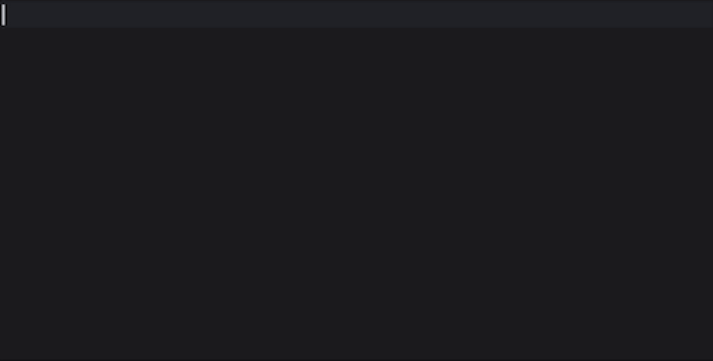

# Programme

Qui n’a jamais mis un type any, car il n’arrivait pas à typer comme
il le souhaitait ? Certes, c'est rapide, mais vous perdez la
sécurité apportée par TypeScript.

Le système de type est très puissant et cet atelier vous permettra
d’apprendre à maitriser le langage dans le langage ! Pour cela, nous
allons nous inspirer de projets existants pour créer un builder de
requêtes SQL. Grâce à un typage avancé, le compilateur TypeScript
nous assurera une expérience développeur optimale avec
autocomplétion et sécurité de type lors du développement. La
sécurité apportée par le compilateur nous permet d’avoir une couche
ultra-légère à l’exécution pour des performances optimales.

Que vous soyez, débutant ou confirmé, vous êtes tous et toutes les
bienvenues. À la fin de cet atelier, vous ne vous sentirez plus
jamais démuni à la lecture d’une page de définition TypeScript.

## Prérequis :

- Connaissances de base TypeScript
- Votre ordinateur 💻

## Objectif final

## Rejoindre TypeScript Workshop Companion

:::info Setup

Une fois le repository cloné, n'oubliez pas de lancer la commande `npm install` ou `yarn install`

:::

## Conseils avant de commencer

- L'exercice 0 va vous permettre de parcourir les concepts de bases
- À partir de l'exercice 1, nous commencerons à construire notre builder de requêtes SQL.
- Appuyez-vous sur les indices qui sont progressifs que vous trouverez dans chaque exercice.
- La section "ressources" est là pour vous aiguiller sur les concepts qui sont abordés dans l'exercice.
- Avant de passer à l'exercice suivant, nous vous conseillons de comparer votre code avec la solution.
- Prenez le temps de refactorer, par exemple en extrayant vos types, se sera plus facile pour la suite.
- Il est souvent possible d'extraire des types intermédiaires à partir d'une première solution _inlinée_, ils peuvent s'avérer utiles par la suite.
- Une question, un doute, un concept peu clair appelez-nous !
