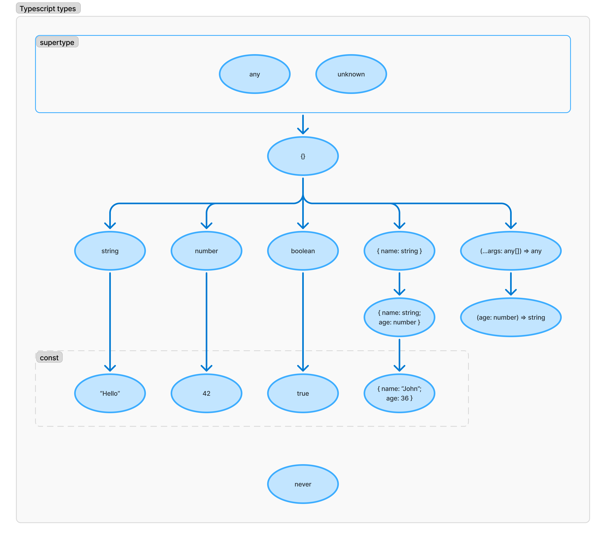

# Hiérarchies des types

On peut se représenter le typage comme un arbre, plus on descend dans cet arbre, plus le type sera spécifique.

Tout en haut, nous avons :

- `any` qui représente n'importe quel type et qui désactive toute aide que le compilateur pourrait vous apporter
- `unknowm` qui représente n'importe quel type et qui vous forcera à verifier son type avant de l'utiliser

L'étage du dessous représente l'object vide dont tous les types primitifs sont des descendants.

En dessous on retrouve donc tous les types primitifs.

Dans le cas de l'objet, plus vous allez lui ajouter d'attributs, plus il sera spécifique.

En bas, on retrouve les constantes qui sont les versions ultra spécifiques des primitives et des objets.

Tout en bas, on a le type `never` qui est utilisé pour matérialiser un type impossible.
Souvent utilisé dans la branche par défaut d'un switch sur lequel vous voulez être exhaustif, et dans les cas impossibles lors de transformations de types.

